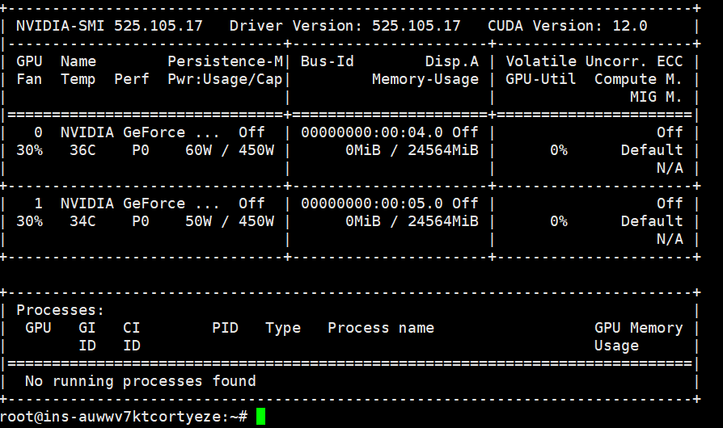
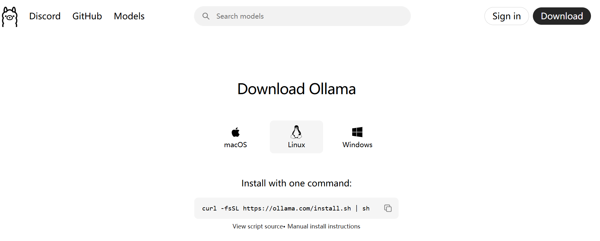
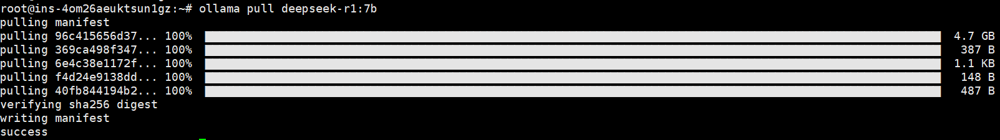
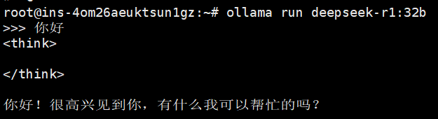
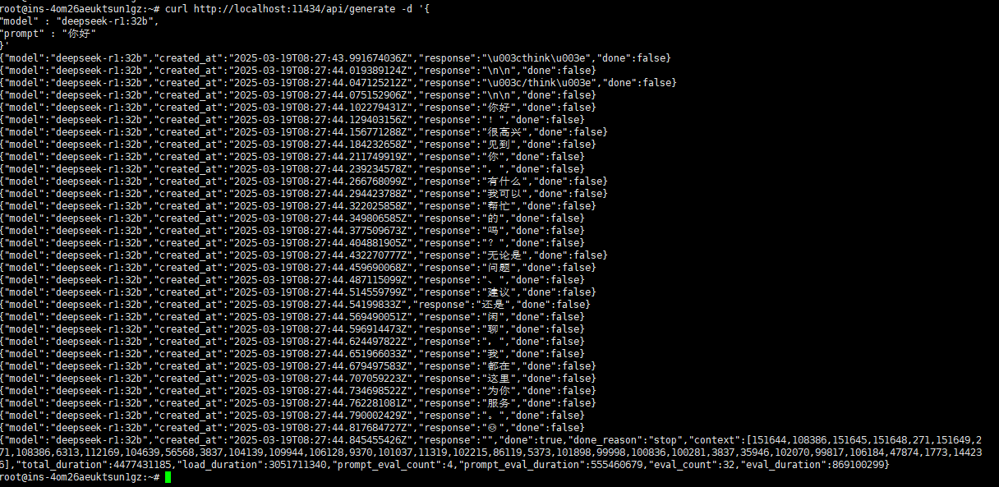
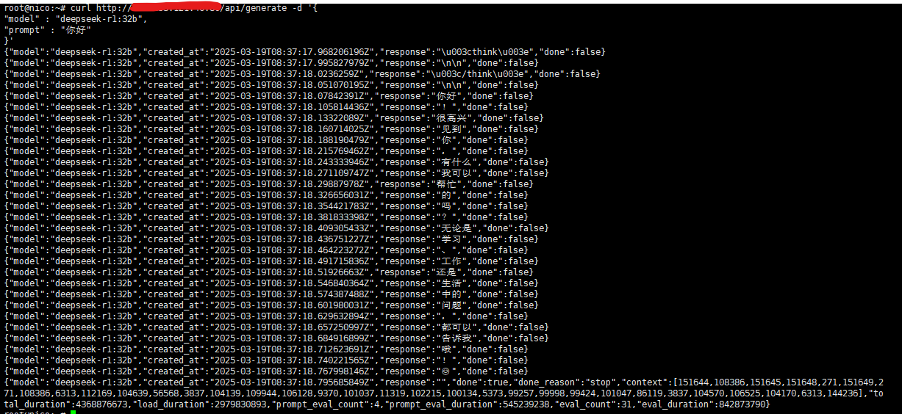
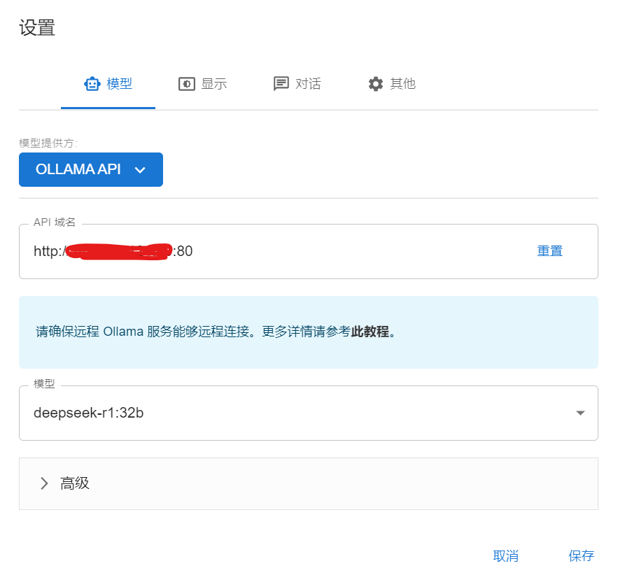
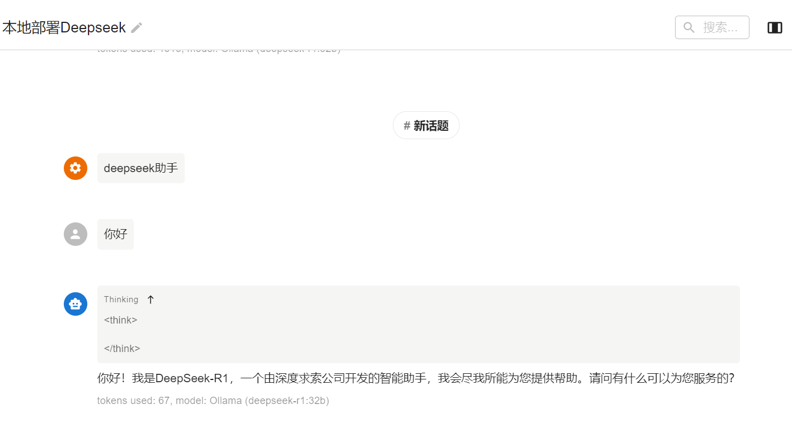

# 在云服务器上部署本地deepseek，通过chatbox公网访问
## 查看GPU配置
```
nvidia-smi
```


要根据自己GPU的配置选择deepseek镜像的版本

可以看到本机配置为4090显卡，24G左右显存，最适配的deepseek镜像为32b

## 安装ollama


根据官网https://ollama.com/download/linux 提示选择自己的操作系统下载，我这里是linux，直接复制官方命令下载
```
curl -fsSL https://ollama.com/install.sh | sh
```
下载完成后会自动识别nvidia驱动，如果没有检测到GPU驱动则会显示CPU-only模式

## 拉取并运行deepseek模型
根据ollama官方model的命令直接拉取
```
ollama pull deepseek-r1:32b
```


也可以直接拉取加运行
```
ollama run deepseek-r1:32b
```
运行成功后输入任意内容开始对话，有返回结果便表示成功部署了deepseek模型



## 绑定本地deepseek服务到本机ip的端口上
找到配置文件并打开
```
vim /etc/systemd/system/ollama.service
```
在service字段中输入如下配置
```
Environment="OLLAMA_HOST=0.0.0.0"
Environment="OLLAMA_ORIGINS=*"
```
ollama默认绑定11434端口号，相当于把deepseek服务绑定到了本机ip地址的11434端口号上

重启ollama服务：
```
systemctl daemon-reload
systemctl restart ollama
```

尝试在本机使用ip端口号访问deepseek服务：
```
curl http://localhost:11434/api/generate -d '{
"model" : "deepseek-r1:32b",
"prompt" : "你好"
}'
```
可以看到本地请求被deepseek响应



## 使用nginx将公网端口映射到本机ip端口上
先安装nginx
```
apt install nginx
```
创建deepseek.conf配置文件用于转发端口
```
vim /etc/nginx/sites-avaliable/deepseek.conf
```
在配置文件中输入如下内容
```
server {
    listen <云服务器对外ip地址>:80;
    server_name _;

    location / {
        proxy_pass http://localhost:11434; #ollama初始绑定11434端口号
        proxy_set_header Host localhost:11434; #这里不改变入方向header会导致本地部署ollama服务拒绝访问403
        proxy_set_header X-Real-IP $remote_addr;
        proxy_set_header X-Forwarded-For $proxy_add_x_forwarded_for;
        proxy_set_header X-Forwarded-Proto $scheme;
    }
}
```
使用```nginx -t```来确认配置文件是否正确，若正确，重启nginx服务
```
systemctl restart nginx
```

## 使用不同网段的主机curl命令尝试连接deepseek
切换到不同网段的云服务器上去尝试连接deepseek服务，看是否能够访问服务：
```
curl http://<云服务器公网ip>:80/api/generate -d '{
"model" : "deepseek-r1:32b",
"prompt" : "你好"
}'
```
输入如下:



## 使用chatbox拉去部署在云服务器的deepseek api
在windows机器上下载chatbox，进入到主界面后，配置相应的公网ip和端口，选择相对应的镜像：



配置完成后就可以开始使用云服务器上本地化部署的deepseek了：


